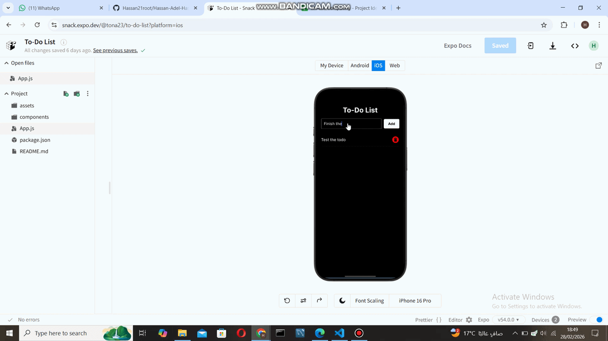

# Mobile Computing (MC2026) - Assignments Workspace

**Student:** Hassan Adel Hassan  
**Institution:** Faculty of Engineering, Helwan University (FEHU)  
**Instructor:** Eng. Rania El-Sayed  

## About This Repository
Welcome to my workspace for the Mobile Computing course. This repository serves as a central directory for all my lab assignments and projects completed throughout the semester. All projects are built using React Native and the Expo framework.

---

## 📂 Assignments Directory

| Lab / Assignment | Project Name | Preview | Key Technologies & Features | Live Expo Snack | Status |
| :--- | :--- | :---: | :--- | :---: | :---: |
| **Assignment 01** | **To-Do List App** |  | React Native, `useState`, `FlatList`, Inter Google Fonts, Custom Dark Theme | [🔗 View on Snack](https://snack.expo.dev/@tona23/to-do-list) | ✅ Complete |
| **Assignment 02** | **Upcoming** | ⏳ | To be determined | - | ⏳ Pending |
| **Assignment 03** | **Upcoming** | ⏳ | To be determined | - | ⏳ Pending |

---

## 🛠️ Tech Stack Overview
* **Framework:** React Native & Expo Snack
* **Design Strategy:** High-Contrast Dark Theme utilizing `Inter` typography for optimal readability.

*Repository maintained by Hassan Adel Hassan for the Spring 2026 semester.*
